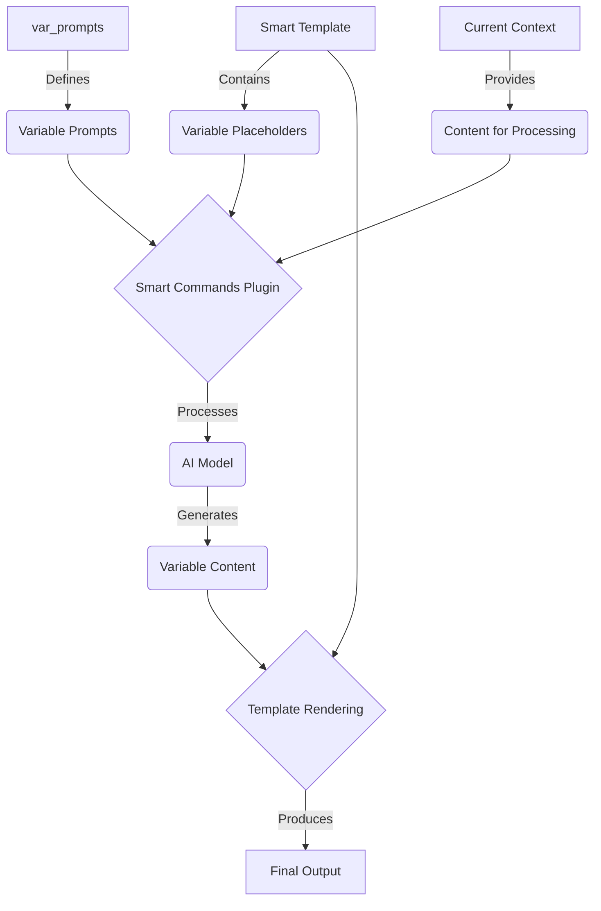

# Smart Commands for Obsidian

Smart Commands is a powerful community plugin for Obsidian that allows you to create and use configurable commands utilizing Smart Environments.

## Features

- **Smart Templates**: Create and use customizable templates with dynamic variables.
- **AI-Powered**: Leverage AI models to generate content based on your templates.
- **Flexible Configuration**: Choose your preferred AI model platform and customize settings.
- **Easy Integration**: Seamlessly integrates with your existing Obsidian Smart Environment.

## Installation

Currently in beta and requires manual installation.

## Usage

1. Set up your preferred AI model platform in the plugin settings.
2. Create smart templates in the designated templates folder.
3. Use the command palette to run your smart templates on your notes or selections.

## Configuration

### Model Platform

Choose your preferred AI model platform (e.g., OpenAI) and enter your API key in the settings.

### Templates Folder

Specify the folder where your smart templates will be stored.

### Variable Prompts

Customize the prompts for template variables like summary, notes, and mermaid charts.

## Creating Templates

1. Navigate to your designated templates folder.
2. Create a new Markdown file for your template.
3. Use special syntax like `{{ variable_name }}` to define dynamic parts of your template.

Example template:
```markdown
# Default Smart Template

### Summary
{{ summary }} <- Simple bracket syntax

### Notes
{{ notes }}

### Chart
<%- '```mermaid' %> <- EJS syntax is also available
{{ mermaid }}
<%- '```' %>
```

## How it Works



## About

Created by [🌴 Brian](https://x.com/wfhbrian) as a companion plugin to [Smart Connections](https://github.com/brianpetro/obsidian-smart-connections/), a plugin for Obsidian that implements a Smart Environment for utilizing AI to enhance your notes.