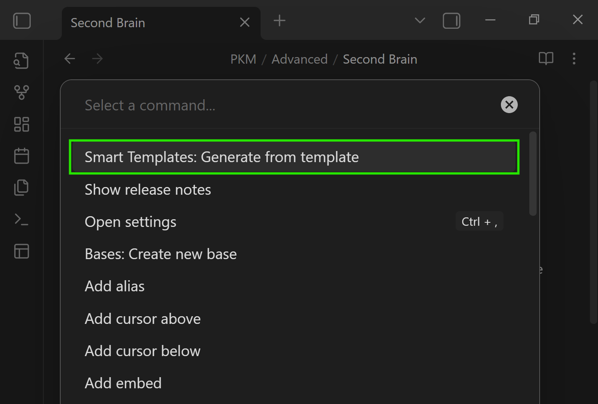
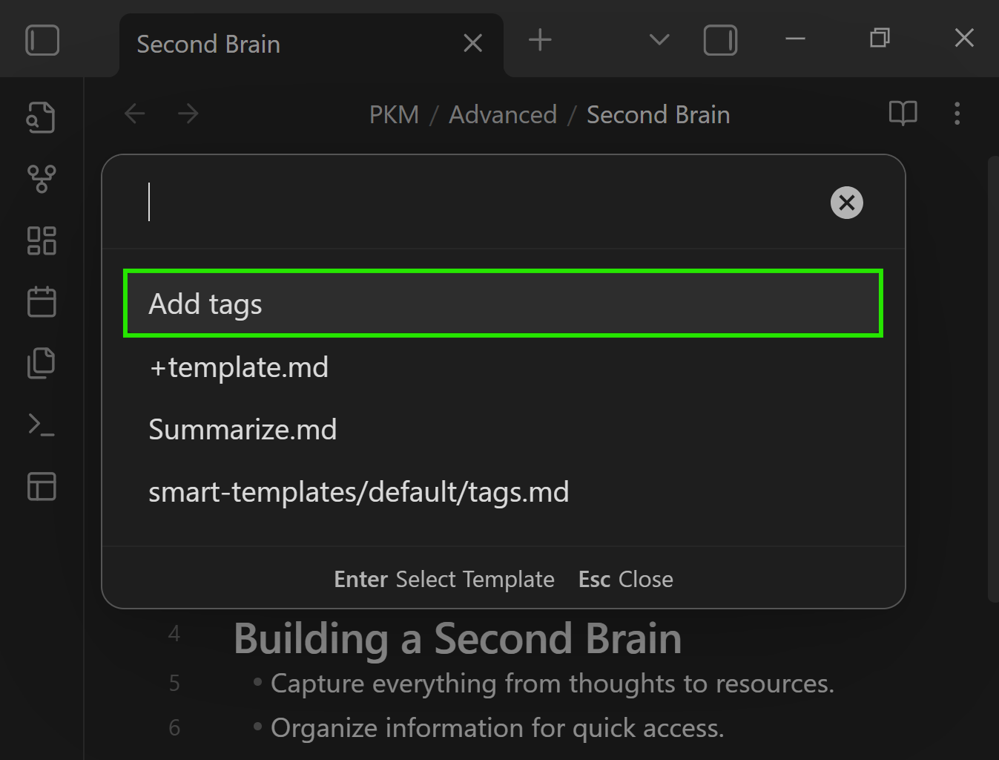
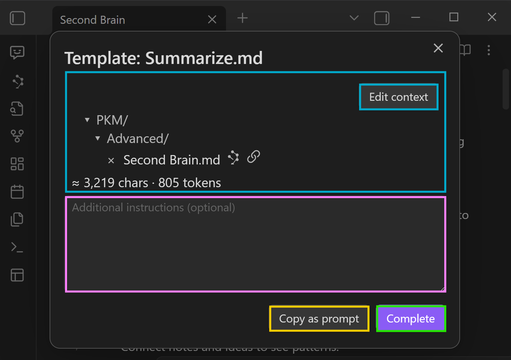
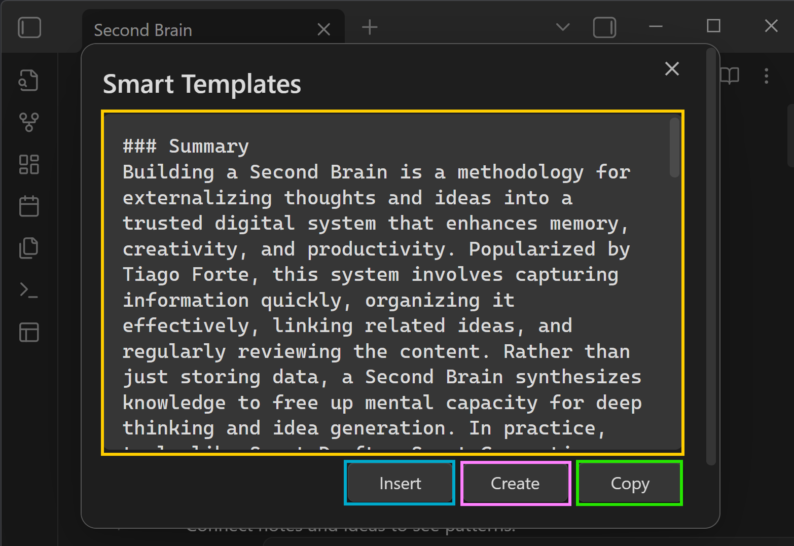
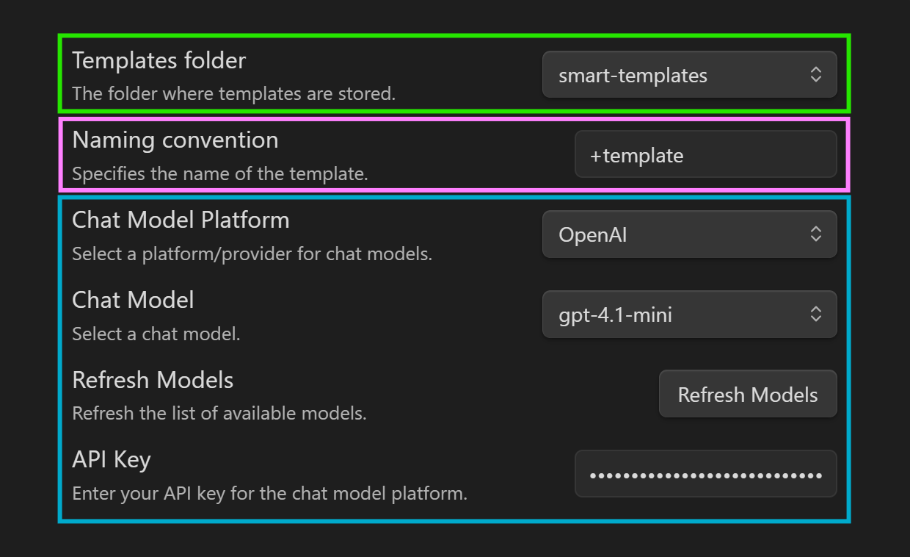

Stop staring at blank pages. **Smart Templates writes first drafts, summaries, and tag lists in seconds** so you can think instead of format.

> [!NOTE] Why templates?  
> Every prompt is a mini project: gather context, write instructions, copy results. Smart Templates turns that slog into a single command.

# Smart Templates `v1.1`

**Stop fighting boiler-plate.** **Smart Templates turns any snippet into a reusable, context-aware template. Every new note starts perfectly structured and ready for flow.**

✔️ Zero-setup: drop a Markdown file in the templates folder and go
🔐 Local-first, privacy-preserving by default
⚡ Works with 1000s of AI models via Smart Environment
⚔️ Mission-driven, community-supported, user-aligned

---

## Mission-driven

The Obsidian community proved that user-aligned software can out-innovate closed silos. Smart Templates is built from scratch on those same principles: open-source tools that empower individuals, not gatekeepers.

## Private by design

All parsing, variable substitution, and AI prompting run locally. Your vault never leaves your device unless you choose to share it. Choose local or API LLMs on your terms.

---

## Getting Started

### Install

- Open **Settings → Community plugins → Browse**
- Search for **Smart Templates** and click **Install**, then **Enable**

### Generate from a template

- **Green**: shows the command **Smart Templates: Generate from template** in the command palette.

### Pick a template

- **Green**: Select "Add tags" template

### Prepare context and add instructions

- **Blue**: Shows the currently selected context and **Edit context** button to open the [Smart Context](http://obsidian.md/plugins?id=smart-context) selector.
- **Pink**: Free-form **Additional instructions** area.
- **Green**: **Complete** button begins streaming the template output.

### Watch, insert, or copy

- **Yellow**: Live stream preview of the template output
- **Blue**: **Insert** → pastes output at the cursor position in the current note
- **Pink**: **Create** → makes a new note with the output
- **Green**: **Copy** → copies output to the clipboard

## Settings

- **Green**: **Templates folder** selector imports notes from this folder as templates
- **Pink**: **Naming convention** pattern imports notes with this name as templates
- **Blue**: configure the chat model platform and model

---

## Core features

- **Modal previews**: see output before it lands in your note
- **AI prompts in frontmatter**: add a `prompt:` key and Smart Templates merges it into the completion flow
- **Multiple output targets**: insert inline, create a new note, or copy to clipboard
- **Thin, dependency-free bundle**: built on dependency-free Smart Environment: easy to audit, fast to load
- **Smart Context integration**: pull semantic matches, backlinks, or folder scopes into template context

## Settings
- `template_folder`: vault-relative path for template discovery
- `template_name`: glob-style pattern to identify template files

---

## Smart Ecosystem

Smart Templates slots into the *Local Smart Environment* alongside **Smart Connections**, **Smart Context**, **Smart Chat**, and **Smart Editor**. Each tool focused on turning raw notes into realized ideas.

## Thanks to the community

Your feedback drives the roadmap and your support keeps the lights on. Together we are proving that user-aligned tools can empower ordinary people to achieve extraordinary results. 🌴