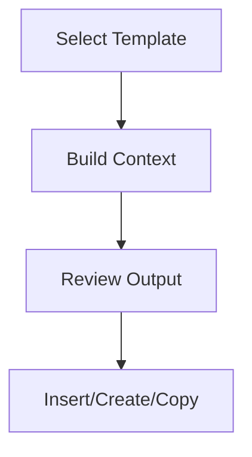

## API Overview

### Functions
- `build_template_completion(env, template, ctx_key, user_message, chat_thread?)`
				- Returns a `SmartCompletion` from the active `SmartChatThread`.
				- Creates a new chat thread if none exists and applies the context key.
				- Uses the provided `chat_thread` when specified.
- `run_template_completion(env, template, ctx_key, user_message, handlers, chat_thread?)`
				- Builds the completion via `build_template_completion` and calls `completion.init({stream:true})` with provided stream handlers.

### Data Structures
- `SmartTemplate`
- `SmartCompletion`
- `SmartChatThread`

