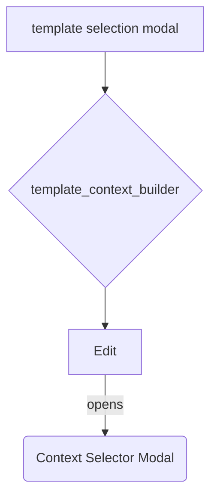

### template_context_builder.js

| Function | Description |
| --- | --- |
| `render(ctx, opts)` | Renders a context builder with an **Edit** button that opens the Context Selector modal. Uses `smart-context-obsidian`'s `context_builder` component. |
| `build_html(ctx)` | Returns the HTML string for the container element. |

